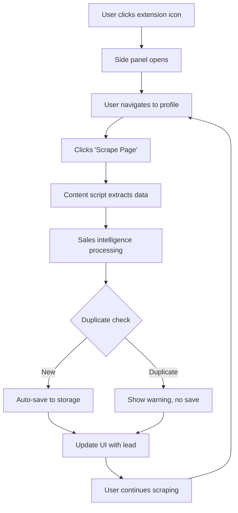

# Kejani Leads Scraper - Chrome Side Panel Extension

> **A powerful, local-first Chrome extension for sales professionals to collect, enrich, and manage leads from social media platforms with AI-powered sales intelligence.**

---

## 📋 Table of Contents

- [Overview](#overview)
- [Features](#features)
- [Architecture](#architecture)
- [Installation](#installation)
- [User Guide](#user-guide)
- [Technical Specification](#technical-specification)
- [Development](#development)
- [Troubleshooting](#troubleshooting)

---

## 🎯 Overview

Kejani Leads is a Chrome extension that operates as a **persistent side panel**, allowing sales professionals to collect lead information across multiple tabs without losing their session. The extension scrapes profile data from social media platforms, enriches it with sales intelligence, and provides flexible export options.

### Key Differentiators

- **Persistent Session**: Side panel stays open while switching tabs
- **Local-First**: All data stored locally, no cloud dependency
- **Zero Configuration**: Works out of the box with intelligent fallbacks
- **Sales Intelligence**: Auto-tagging, duplicate detection, and icebreaker generation
- **Multi-Platform**: LinkedIn, X/Twitter, Facebook, and generic web pages

---

## ✨ Features

### 🔄 Session Persistence

- **Side Panel UI**: Opens in browser sidebar, remains visible across tab switches
- **Auto-Save**: All leads automatically saved to `chrome.storage.local`
- **Cross-Session**: Data persists even after closing and reopening the extension
- **Manual Reset**: Clear session data anytime via trash icon

### 📊 Data Collection

**Supported Platforms:**

| Platform | Data Extracted |
|----------|---------------|
| **LinkedIn** | Name, Headline, Location, Profile URL |
| **X (Twitter)** | Handle, Bio, Website, Location, Verified Status |
| **Facebook** | Name, Profile Details, URL |
| **Generic Pages** | Email addresses, Phone numbers |

### 🧠 Sales Intelligence Suite

#### 1. Smart Tagging
Automatically categorizes leads based on keywords in their bio/title:
- **Decision Maker** (CEO, Founder, Director, VP)
- **Recruiter** (HR, Talent, Hiring)
- **Tech** (Developer, Engineer, CTO)
- **Sales** (Account Executive, SDR, BDR)
- **Marketing** (CMO, Brand, Growth, SEO)
- **Real Estate** (Realtor, Broker, Property)

#### 2. Duplicate Detection
- Checks URL match (primary)
- Falls back to name matching
- Visual warning with red card UI
- Prevents auto-save when duplicate detected

#### 3. Icebreaker Generation
Creates personalized opening messages:
```
"Hi [FirstName], I saw you're the [Title] at [Company]. 
Would love to connect and discuss how we can help achieve 
your goals this quarter."
```
One-click copy to clipboard.

#### 4. Campaign Management
Organize leads by custom campaign names (e.g., "Q1 Cold Outreach", "Enterprise Prospects").

### 💾 Storage Modes

#### Auto-Sync Mode (File System API)
- Connect directly to local `.xlsx` file
- Leads appended in real-time
- No manual downloads needed
- Requires Chrome 86+ and file permissions

#### Manual Mode (Fallback)
- Leads stored in browser memory
- Download as Excel (.xlsx) or CSV
- Share via social platforms
- Copy to clipboard for CRM import

### 📤 Export & Sharing

**Download Options:**
- Excel (.xlsx) with formatted columns
- CSV for universal compatibility

**Social Sharing:**
- Email (mailto link)
- WhatsApp (direct message)
- Telegram (share dialog)
- X/Twitter (tweet draft)
- Clipboard (copy CSV)

### 📋 Leads List View

Toggle collapsible list showing all collected leads:
- Profile avatars (first letter)
- Name and title
- Company information
- Smart tags (up to 3)
- Scrollable with 300px max height

---

## 🏗️ Architecture

### Tech Stack

- **Frontend**: React 18 + Vite
- **Styling**: Tailwind CSS
- **Icons**: Lucide React
- **Data Processing**: xlsx.js
- **Extension API**: Chrome Extensions Manifest V3

### Project Structure

```
leads-extenstion/
├── src/
│   ├── Popup.jsx                  # Main UI component (side panel)
│   ├── scrappers/
│   │   ├── index.js               # Scraper router
│   │   ├── linkedin.js            # LinkedIn scraper
│   │   ├── twitter.js             # X/Twitter scraper
│   │   ├── facebook.js            # Facebook scraper
│   │   └── generic.js             # Email/Phone extractor
│   ├── services/
│   │   └── excelService.js        # Excel/CSV export logic
│   ├── utils/
│   │   └── salesIntelligence.js   # Tagging, dedup, icebreaker
│   └── manifest.json              # Extension manifest
├── public/
│   └── background.js              # Service worker (side panel handler)
├── dist/                          # Built extension (generated)
└── package.json
```

### Data Flow



### Chrome APIs Used

- **Side Panel API** (`chrome.sidePanel`): Persistent UI
- **Scripting API** (`chrome.scripting`): Execute scrapers on active tab
- **Storage API** (`chrome.storage.local`): Persist session data
- **Tabs API** (`chrome.tabs`): Query active tab
- **Downloads API** (`chrome.downloads`): Save files locally
- **Action API** (`chrome.action`): Handle extension icon clicks

---

## 🚀 Installation

### Prerequisites

- Node.js 16+ and npm
- Chrome 88+ (for Side Panel API)

### Build Steps

1. **Clone the repository**:
   ```bash
   cd /home/gralex/Desktop/leads-extenstion
   ```

2. **Install dependencies**:
   ```bash
   npm install
   ```

3. **Build the extension**:
   ```bash
   npm run build-extension
   ```
   This creates the `dist/` folder with the production build.

4. **Load into Chrome**:
   - Navigate to `chrome://extensions/`
   - Enable **Developer mode** (toggle in top-right)
   - Click **Load unpacked**
   - Select the `dist/` folder

5. **Verify installation**:
   - Extension icon should appear in toolbar
   - Click icon → Side panel should open on right side

---

## 📖 User Guide

### First-Time Setup

1. **Open the side panel**: Click the extension icon in Chrome toolbar
2. **Choose storage mode**:
   - **Auto-Sync**: Click "Link Excel File" and select a `.xlsx` file
   - **Manual**: Skip connection, use in-memory storage

3. **Set campaign name** (optional): Enter in the text field at top

### Collecting Leads

1. **Navigate** to a LinkedIn, X, Facebook profile or contact page
2. **Click** "Scrape Page" button in the side panel
3. **Review** the preview card:
   - Green card = New lead (auto-saved)
   - Red card = Duplicate (not saved)
4. **Copy icebreaker** if needed (click the message box)
5. **Switch tabs** freely - side panel stays open
6. **Repeat** steps 1-5 for more leads

### Viewing Collected Leads

- **Session counter** shows total leads collected
- **Click list icon** (📋) to toggle leads list view
- **Scroll** through all leads with details
- **Close list** via X button or list icon again

### Exporting Data

#### Auto-Sync Mode
- Leads are already in your Excel file
- No export needed

#### Manual Mode
1. **Choose format**: Toggle Excel/CSV in the storage section
2. **Click Save**: Downloads file to default location
3. **Or Share**: Click Share button, choose platform

### Resetting Session

1. **Click trash icon** (🗑️) next to session counter
2. **Confirm** the dialog
3. All leads cleared from memory (irreversible)

### Closing the Extension

- **Click X** on side panel header, or
- **Click extension icon** again to toggle
- Data persists until manually cleared

---

## 🔧 Technical Specification

### Manifest Configuration

**Key Changes from Popup to Side Panel:**

```json
{
  "manifest_version": 3,
  "action": {
    "default_title": "Kejani Leads Scraper"
    // No default_popup - replaced by side_panel
  },
  "side_panel": {
    "default_path": "index.html"
  },
  "permissions": [
    "activeTab",
    "scripting",
    "storage",
    "downloads",
    "clipboardWrite",
    "sidePanel"  // Required for Side Panel API
  ]
}
```

### Storage Schema

**chrome.storage.local keys:**

```javascript
{
  sessionLeads: Array<{
    name: string,
    title: string,
    company?: string,
    location?: string,
    email?: string,
    phone?: string,
    url?: string,
    bio?: string,
    tags: string,        // Comma-separated
    campaign: string,
    timestamp?: string
  }>,
  campaignName: string,
  exportFormat: 'xlsx' | 'csv'
}
```

### Scraper API

Each scraper is a pure function executed in the page context:

```javascript
// Signature
function scraper(): LeadData

// Example: LinkedIn
function linkedinScraper() {
  return {
    name: document.querySelector('.text-heading-xlarge')?.innerText,
    title: document.querySelector('.text-body-medium')?.innerText,
    location: document.querySelector('.text-body-small.inline')?.innerText,
    url: window.location.href
  };
}
```

**Supported URL patterns:**
- `https://*.linkedin.com/*`
- `https://*.twitter.com/*`, `https://*.x.com/*`
- `https://*.facebook.com/*`
- Any other URL (generic email/phone extraction)

### Sales Intelligence Functions

**generateTags(lead)**
- Input: Lead object with `title`, `bio`, `headline` fields
- Output: Comma-separated string of tags
- Logic: Regex matching against TAG_RULES

**checkDuplicate(newLead, existingLeads)**
- Input: New lead + array of existing leads
- Output: Boolean
- Logic: URL match first, then name match (case-insensitive)

**generateIcebreaker(lead)**
- Input: Lead object
- Output: Personalized message string
- Template: `"Hi {firstName}, I saw you're the {title} at {company}..."`

### File System API Usage

```javascript
// Connect to file
const fileHandle = await window.showOpenFilePicker({
  types: [{
    description: 'Excel Files',
    accept: { 'application/vnd.openxmlformats-officedocument.spreadsheetml.sheet': ['.xlsx'] }
  }]
});

// Read existing data
const file = await fileHandle.getFile();
const arrayBuffer = await file.arrayBuffer();
const workbook = XLSX.read(arrayBuffer);

// Write new data
const writable = await fileHandle.createWritable();
await writable.write(new Blob([excelBuffer]));
await writable.close();
```

---

## 💻 Development

### Scripts

```bash
# Development server (not useful for extension)
npm run dev

# Build for production
npm run build

# Build + copy manifest
npm run build-extension

# Lint code
npm run lint
```

### Hot Reload

Chrome extensions don't support hot reload. After code changes:
1. Run `npm run build-extension`
2. Go to `chrome://extensions/`
3. Click reload icon on the extension card

### Adding New Scrapers

1. Create `src/scrappers/platform.js`:
   ```javascript
   export default function platformScraper() {
     return {
       name: /* extraction logic */,
       title: /* extraction logic */,
       // ... other fields
     };
   }
   ```

2. Update `src/scrappers/index.js`:
   ```javascript
   import platformScraper from './platform';
   
   export const getScrapper = (url) => {
     if (url.includes('platform.com')) return platformScraper;
     // ... existing logic
   };
   ```

3. Add host permissions in `manifest.json`:
   ```json
   "host_permissions": [
     "https://*.platform.com/*"
   ]
   ```

### Adding New Tags

Edit `src/utils/salesIntelligence.js`:

```javascript
const TAG_RULES = [
  { label: 'Your Label', keywords: /keyword1|keyword2|keyword3/i },
  // ... existing rules
];
```

---

## 🐛 Troubleshooting

### Extension Won't Open Side Panel

**Symptom**: Clicking icon does nothing
**Solution**:
- Check Chrome version (need 88+)
- Reload extension at `chrome://extensions/`
- Check browser console for errors (F12)

### "File System API not supported"

**Symptom**: No "Link Excel File" button shown
**Cause**: Browser doesn't support File System API (pre-Chromium 86)
**Workaround**: Manual mode still works - download files manually

### Duplicate Detection Not Working

**Symptom**: Same lead saved multiple times
**Causes**:
- Different campaign names (not checked)
- URL vs no URL (fallback to name match may fail)
- Name spelling variations

**Solution**: Manually check before scraping

### Data Not Persisting

**Symptom**: Leads disappear after closing extension
**Debug**:
1. Open DevTools on side panel (right-click → Inspect)
2. Go to Application → Storage → Local Storage
3. Check `chrome-extension://...` for stored data
4. If empty, check for JavaScript errors in console

### Excel File "Permission Denied"

**Symptom**: Can't connect to Excel file
**Solution**: Close Excel/LibreOffice - file is locked while open

### Scraper Returns Empty Data

**Symptom**: "Unknown" name, no title, etc.
**Causes**:
- Page structure changed (selectors outdated)
- Page not fully loaded when scraped

**Debug**:
1. Inspect page DOM
2. Update selectors in `src/scrappers/[platform].js`
3. Add `await` delays if needed (in content script injection)

### Build Errors

**Symptom**: `npm run build-extension` fails
**Common fixes**:
```bash
# Clear cache and reinstall
rm -rf node_modules package-lock.json
npm install

# Update Browserslist
npx update-browserslist-db@latest
```

---

## 📄 License

This project is for internal use. All rights reserved.

---

## 🤝 Support

For issues or feature requests, contact the development team.

---

**Version**: 1.1.0  
**Last Updated**: January 2026  
**Minimum Chrome Version**: 88
